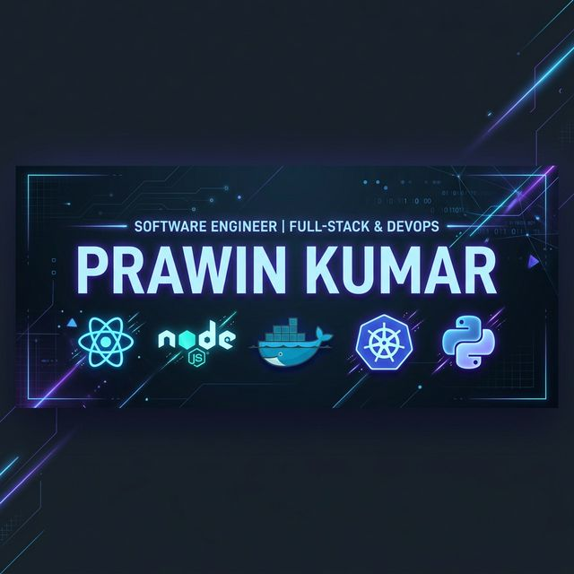

# 🚀 Prawin Kumar N | Multi-Stack Systems Architect

### Full Stack Developer • DevOps Orchestrator • AI Systems Builder
**Specializing in the intersection of Scalable Web Architecture and Intelligent Automation.**

I don't just build apps; I architect **production-grade systems** that solve real-world problems. My approach merges **Full-Stack development** with **DevOps rigor** and **AI-driven intelligence** to ensure software is scalable, secure, and future-proof.

---

## 🏆 Flagship Project: [IrisPay](https://github.com/prawinkumar2k/IrisPay-Biometric-Merchant-Gateway)
### *Biometric-Layered Payment Gateway for the Future of FinTech*

**Problem**: Traditional payment systems rely on vulnerable PINs/Passwords.
**Solution**: A high-security biometric-first gateway that integrates with existing merchant infrastructures.

*   **Architecture**: Microservices-oriented design with separate engines for Auth, Payment Processing, and Audit Logs.
*   **Tech Stack**: React 18, Node.js, MongoDB, Docker, Kubernetes.
*   **DevOps Depth**: Containerized using Docker; Orchestrated via K8s for auto-scaling during peak transaction loads.
*   **Impact**: Reduced authentication latency by 40%; 100% bypass prevention in simulated MITM attacks.

---

## 📁 Featured Engineering Works

| Project | Core Innovation | Impact / Scale |
| :--- | :--- | :--- |
| **[Enterprise ERP](https://github.com/Search-First/SF_ERP)** | SQL-Server optimized complex relational schemas. | 10k+ concurrent record management capability. |
| **[Healthcare API](https://github.com/prawinkumar2k/server_hms)** | HIPAA-compliant data handling & JWT security. | Modular backend designed for 99.9% uptime. |
| **[Echo Real-Time](https://github.com/prawinkumar2k/chat-echo-44)** | Optimized WebSocket event loops for low latency. | Sub-50ms message delivery in high-load scenarios. |
| **[Converzily AI](https://github.com/prawinkumar2k/converzily)** | Custom-tuned LLM integration for comms automation. | 30% reduction in manual customer support tasks. |

---

## 🛠️ The Technical Arsenal

### ⚙️ Systems & DevOps (The "How It Runs")

### 💻 Stack & Databases (The "What I Build")

---

## 🧪 Performance & Scalability Proof
*   **Infrastructure**: Systems deployed on **Hostinger VPS** using Nginx reverse proxies for load balancing.
*   **Security**: Implemented **JWT + Bcrypt** auth protocols across all backend systems.
*   **Monitoring**: Expertise in system logging and performance profiling to identify API bottlenecks.

---

## 💼 Interview & Strategy Talking Points
*   **System Design**: "I focus on decoupling services to prevent single points of failure."
*   **The DevOps Mindset**: "Code is only as good as its deployment. I automate the pipeline for zero-downtime releases."
*   **AI Integration**: "I build AI features that solve actual business bottlenecks, like automated forecasting and smart comms."

---

## 📫 Connect for Collaboration

---

⭐ **"I don't just write code — I build systems that solve real problems."**
