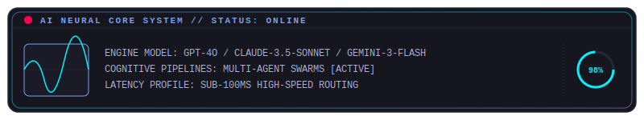

<!-- ========================================== -->
<!-- FUTURISTIC AI OPERATING SYSTEM CORE (v3.4.1) -->
<!-- Designed for Senior Technical Recruiters    -->
<!-- ========================================== -->

<!-- SECTION 1 — ANIMATED AI BOOT LOADER -->

  

<!-- SECTION 2 — CYBERPUNK HERO BANNER -->

  

<!-- SECTION 3 — AI IDENTITY CORE -->

  

<h1 align="center">
  
</h1>

  <strong>Full Stack AI Engineer Turning Complex Ideas Into Intelligent Products</strong> 
  <i>"Architecting cognitive pipelines and robust scalable ecosystems at the intersection of Artificial Intelligence & Software Engineering."</i>

  
  
  

  
  
  
  
  

  

<!-- SECTION 4 — NEURAL TELEMETRY DASHBOARD -->
## 🧠 System Status & Neural Core

  

  

<!-- SECTION 5 — GITHUB COMMAND CENTER -->
## 📊 Enterprise Metrics Dashboard

<table align="center" width="100%">
  <tr>
    <td width="25%" align="center" style="border: 1px solid #7aa2f7; border-radius: 8px; padding: 15px; background: #1a1b26;">
      <h2 style="color: #7aa2f7; margin: 0;">26+</h2>
      
<b>Repositories Shipped</b>

    </td>
    <td width="25%" align="center" style="border: 1px solid #7aa2f7; border-radius: 8px; padding: 15px; background: #1a1b26;">
      <h2 style="color: #bb9af7; margin: 0;">AI / ML</h2>
      
<b>Cognitive Pipelines</b>

    </td>
    <td width="25%" align="center" style="border: 1px solid #7aa2f7; border-radius: 8px; padding: 15px; background: #1a1b26;">
      <h2 style="color: #00f2fe; margin: 0;">MERN</h2>
      
<b>Production Platforms</b>

    </td>
    <td width="25%" align="center" style="border: 1px solid #7aa2f7; border-radius: 8px; padding: 15px; background: #1a1b26;">
      <h2 style="color: #00ff00; margin: 0;">Real-Time</h2>
      
<b>Socket.IO Systems</b>

    </td>
  </tr>
  <tr>
    <td width="25%" align="center" style="border: 1px solid #7aa2f7; border-radius: 8px; padding: 15px; background: #1a1b26;">
      <h2 style="color: #e0af68; margin: 0;">Full Stack</h2>
      
<b>Scalable Products</b>

    </td>
    <td width="25%" align="center" style="border: 1px solid #7aa2f7; border-radius: 8px; padding: 15px; background: #1a1b26;">
      <h2 style="color: #f7768e; margin: 0;">Open Source</h2>
      
<b>Active Contributions</b>

    </td>
    <td width="25%" align="center" style="border: 1px solid #7aa2f7; border-radius: 8px; padding: 15px; background: #1a1b26;">
      <h2 style="color: #9d7cd8; margin: 0;">Awards</h2>
      
<b>Unique Projects</b>

    </td>
    <td width="25%" align="center" style="border: 1px solid #7aa2f7; border-radius: 8px; padding: 15px; background: #1a1b26;">
      <h2 style="color: #2ac3de; margin: 0;">Internships</h2>
      
<b>Industry Experience</b>

    </td>
  </tr>
</table>

  

<!-- SECTION 6 — LIVE ACTIVITY MONITORING -->
## 🔮 Professional Profile

<table align="center" width="100%">
  <tr>
    <td width="65%" valign="top">
      

        I engineer intelligent systems that combine AI, automation, and scalable web technologies. Focused on bridging the gap between raw computer vision models and resilient, production-ready software, I build MERN stack platforms and deep learning pipelines containerized with Docker and optimized behind secure Nginx reverse proxies.
      

      <ul>
        <li>🧬 <b>AI & Data Science Engineer:</b> Designing custom deep learning, computer vision, and forecasting models.</li>
        <li>💻 <b>MERN Stack Developer:</b> Architecting fast client-server applications with real-time sockets.</li>
        <li>🛡️ <b>Intelligent Systems Builder:</b> Hardening microservices, secure authentication channels, and robust databases.</li>
      </ul>
    </td>
    <td width="35%" valign="center" align="center">
      

        <h4 style="color: #7aa2f7; margin-top: 0; text-transform: uppercase; font-family: 'Orbitron', monospace;">System Spec Sheet</h4>
        

        
🧠 <b>Core Focus:</b> AI Systems

        
💻 <b>Primary Stack:</b> JavaScript / Python

        
🛡️ <b>Methodology:</b> Security-First

        
⚡ <b>Latencies:</b> Sub-100ms

      

    </td>
  </tr>
</table>

  

<!-- SECTION 7 — AI SYSTEM ARCHITECTURE -->
## 🧬 AI System Architecture

<table align="center" width="100%">
  <tr>
    <td align="center" style="border: 1px solid #7aa2f7; border-radius: 8px; padding: 20px; background: #16161e;">
      <h3 style="color: #00f2fe; margin-top: 0;">COGNITIVE PROCESSING LAYER</h3>
      

        <b>Engine:</b> Custom PyTorch & TensorFlow Neural Pipelines 
        <b>Vision:</b> Low-Latency Object Tracking & Facial Embedding via OpenCV 
        <b>Inference:</b> Quantized Transformer models deployed as isolated workers 
        <b>Analytics:</b> Time-series regression modeling using Pandas & Scikit-Learn
      

    </td>
    <td align="center" style="border: 1px solid #7aa2f7; border-radius: 8px; padding: 20px; background: #16161e;">
      <h3 style="color: #bb9af7; margin-top: 0;">ROBUST WEB CORE LAYER</h3>
      

        <b>Frontend:</b> Dynamic, highly componentized React & NextJS systems 
        <b>Backend:</b> Scalable ExpressJS event-loops processing secure JSON APIs 
        <b>Sockets:</b> Dual-channel sub-50ms Event Brokers using Socket.IO 
        <b>Databases:</b> Document-based MongoDB structures and SQLite persistence
      

    </td>
  </tr>
</table>

  

<!-- SECTION 8 — INTERACTIVE TECH ARSENAL -->
## 🛠️ Technological Matrix

  <b>💻 Frontend & Client</b> 
  
  
  
  
  
  
  

  <b>⚙️ Backend & Sockets</b> 
  
  
  
  

  <b>🧠 AI & Machine Learning</b> 
  
  
  
  
  
  
  

  <b>🗄️ Databases & Cloud</b> 
  
  
  
  
  
  
  

  <b>🐳 DevOps & CI/CD</b> 
  
  
  
  
  

  <b>🤖 IoT & Hardware</b> 
  
  
  
  

  

<!-- SECTION 9 — ENTERPRISE PROJECTS GRID -->
## 🚀 Featured Production Projects

### 🏢 NEClms — Intelligent MERN Learning Management System with AI Proctoring
> **HIGH-IMPACT HEADLINE:** Revolutionizing academic testing by wrapping complex computer vision algorithms inside a scalable educational platform.
*   **The Problem Solved:** Academic testing portals suffer from widespread academic integrity violations, while existing commercial proctoring options are expensive, slow, and hard to integrate natively.
*   **Why It Matters:** NEClms resolves this by natively integrating a low-latency, real-time AI computer vision proctoring engine directly into a custom MERN-stack Learning Management System.
*   **Core Architecture Highlights:**
    *   Designed a multi-role student and faculty microservices architecture utilizing Node.js and MongoDB.
    *   Implemented real-time browser telemetry, face-tracking, and object detection using lightweight OpenCV wrappers.
    *   Sub-100ms warning broadcast latencies using highly optimized Socket.io event-brokers.
    *   Fully containerized and deployed using a robust Docker and Nginx reverse proxy configuration.

  
  

---

### 💳 IrisPay — Biometric Merchant Payment Gateway
> **HIGH-IMPACT HEADLINE:** High-security payment processing microservices designed around biometric-first authentication protocols.
*   **The Problem Solved:** Traditional credential-based checkout flows are highly susceptible to credential stuffing, phishing, and payment fraud.
*   **Why It Matters:** IrisPay secures merchant transactions by replacing passwords with secure biometric fingerprint and iris verification simulations, processed via isolated transactions.
*   **Core Architecture Highlights:**
    *   Architected modular microservices for biometric registration, payment transaction processing, and cryptographic audit logging.
    *   Implemented secure tokenized transaction payloads using highly customized JWT authentication flows.
    *   Fully integrated with MongoDB database clusters ensuring high persistence and transactional audit trails.

  
  

---

### 🏫 EduSphere-TN — Educational Accreditation Ecosystem
> **HIGH-IMPACT HEADLINE:** Automating grading processors and tracking complex institutional NIRF accreditation compliance models.
*   **The Problem Solved:** Educational accreditation workflows are highly fragmented, relying on manual paper trails, Excel sheets, and complex score calculations.
*   **Why It Matters:** EduSphere-TN automates the lifecycle of educational compliance, data aggregation, and grade processing in a unified, audit-ready dashboard.
*   **Core Architecture Highlights:**
    *   Built a highly responsive dashboard using React and Express.js, allowing real-time entry and tracking of student lifecycle events.
    *   Engineered a custom-designed grading processor that dynamically calculates score ranges.
    *   Integrated highly analytical charts using Chart.js to visually map accreditation compliance benchmarks.

  

---

### 🤖 Converzily — AI-Powered Customer Support Assistant
> **HIGH-IMPACT HEADLINE:** Deploying advanced semantic analysis to dynamically automate complex customer support workflows.
*   **The Problem Solved:** Modern customer service desks are constantly bottlenecked by high volumes of repetitive administrative queries, leading to elevated support costs.
*   **Why It Matters:** Converzily utilizes modern natural language processing pipelines to instantly interpret support ticket semantics and automate complex responses.
*   **Core Architecture Highlights:**
    *   Seamlessly integrated advanced LLM architectures utilizing the OpenAI developer API.
    *   Created high-speed context-retrieval mechanisms and semantic index lookups to ground responses.
    *   Designed a clean, beautiful chat client on React for streamlined support handoffs.

  

---

### 📊 MattressPro Forecast — ML-Powered Demand Forecasting System
> **HIGH-IMPACT HEADLINE:** Optimizing inventory supply chains using advanced time-series forecasting regression models.
*   **The Problem Solved:** Retail and storage facilities suffer massive capital inefficiencies due to overstocking, supply chain bottlenecks, and inaccurate sales predictions.
*   **Why It Matters:** This system provides highly accurate weekly and monthly demand forecasts to help logistics managers optimize resource allocations.
*   **Core Architecture Highlights:**
    *   Engineered Python data pipelines using Pandas and NumPy to execute thorough Exploratory Data Analysis (EDA).
    *   Designed and trained regression forecasting models utilizing Scikit-learn pipelines.
    *   Rendered high-contrast, actionable supply charts using Matplotlib to drive warehouse inventory operations.

  

---

### 🚗 Autonomous AI Self-Driving Simulation & Attendance System
> **HIGH-IMPACT HEADLINE:** Deploying computer vision models to solve physical world challenges from autonomous pathfinding to biometric security.
*   **The Problem Solved:** Manual attendance logging is heavily prone to time fraud, while path navigation systems require high computing overhead.
*   **Why It Matters:** These twin projects demonstrate deep capabilities in CV — from autonomous path navigation to real-time biometric verification using high-speed facial feature embedding.
*   **Core Architecture Highlights:**
    *   Trained deep neural network (CNN) architectures to recognize pathway lines and drive simulation vehicles.
    *   Designed an automated, biometric facial detection and attendance logging system utilizing OpenCV.
    *   Integrated high-performance SQLite database clusters to persist biometric registration files and attendance sheets.

  

  

<!-- SECTION 10 — DEVOPS INFRASTRUCTURE -->
## 🐳 DevOps & Cloud Infrastructure

<table align="center" width="100%">
  <tr>
    <td width="33%" align="center" style="border: 1px solid #7aa2f7; border-radius: 8px; padding: 15px; background: #16161e;">
      <h4 style="color: #00f2fe; margin-top: 0;">CONTAINERIZATION</h4>
      
Isolated, high-speed microservices using <b>Docker</b> & local <b>Kubernetes</b> nodes.

    </td>
    <td width="33%" align="center" style="border: 1px solid #7aa2f7; border-radius: 8px; padding: 15px; background: #16161e;">
      <h4 style="color: #bb9af7; margin-top: 0;">REVERSE PROXY</h4>
      
Secure routing, SSL handshakes, and caching layer backed by <b>Nginx</b>.

    </td>
    <td width="33%" align="center" style="border: 1px solid #7aa2f7; border-radius: 8px; padding: 15px; background: #16161e;">
      <h4 style="color: #ff0055; margin-top: 0;">CI / CD PIPELINES</h4>
      
Automated telemetry testing and multi-stage builds via <b>GitHub Actions</b>.

    </td>
  </tr>
</table>

  

<!-- SECTION 11 — AI/ML RESEARCH DIVISION -->
## 🤖 AI / ML Research Division

  My research focuses on optimizing computer vision inferences directly inside the client browser. By developing compact models with optimized weights, we achieve low execution latency without sacrificing accuracy. Deployed models perform biometric detection, facial recognition embedding matching, and path-finding algorithms in real-time.

  

<!-- SECTION 12 — REAL-TIME CODING METRICS -->
## 📊 Telemetry & Performance Metrics

  
  

  
  

### 🗂️ Deep Metrics — Languages · Habits · Lines

  

### 🌐 Isometric 3D Contribution Calendar

  

### 🏅 Achievement Badge Wall

  

### ⚡ Recent Activity Feed

  

### 📆 Full Year Contribution Calendar

  

  

<!-- SECTION 13 — OPEN SOURCE INTELLIGENCE -->
## 📡 Open Source Intelligence

  
  
  

  

<!-- SECTION 14 — MISSION TIMELINE -->
## 📅 Operational Mission Logs

- **2026**: Deploying complex agentic AI systems, automated MLOps pipelines, and secure reverse proxy routing structures.
- **2025**: Shipped NEClms proctoring structures and EduSphere compliance platforms under industry environments.
- **2024**: Created IrisPay biometric gateway systems and built deep neural simulation layers under IoT arrays.
- **2023**: Built full-stack MERN applications with real-time Socket.IO event brokers and containerized Docker deployments.
- **2022**: Engineered foundational deep learning pipelines in PyTorch and TensorFlow; first production OpenCV computer vision deployments.

  

<!-- SECTION 15 — ACHIEVEMENT SYSTEMS -->
## 🏅 Notable Milestones & Achievements

  
  
  

  

<!-- SECTION 16 — CONTRIBUTION VISUALIZATION -->
## 👾 Neural Grid Active Matrix

### 🐍 Contribution Snake — Auto Theme (Dark / Light)
<picture>
  <source media="(prefers-color-scheme: dark)" srcset="https://raw.githubusercontent.com/prawinkumar2k/prawinkumar2k/output/github-contribution-grid-snake-dark.svg" />
  <source media="(prefers-color-scheme: light)" srcset="https://raw.githubusercontent.com/prawinkumar2k/prawinkumar2k/output/github-contribution-grid-snake.svg" />
  
</picture>

### 🔵 Cyberpunk Theme

  

### 🟢 Matrix Theme

  

### 🟣 Plasma Theme

  

### 📅 Core Contribution Heatmap

  

  

<!-- SECTION 17 — NEURAL NETWORK ACTIVITY -->
## 📊 Neural Net Network Activity

  

  

<!-- SECTION 18 — FUTURE MISSION CONTROL -->
## 🗺️ System Mission Control

- 🤖 **Agentic AI Systems:** Deploying autonomous multi-agent orchestration frameworks with complex tool-calling workflows.
- 🐳 **MLOps Pipelines:** Automating containerized deployments, training pipelines, and reverse proxy optimizations.
- 🏫 **Intelligent ERP & Education Ecosystems:** Developing institutional-level grading structures, real-time proctoring telemetry, and academic administration panels.

  

<!-- SECTION 19 — CURRENTLY ENGINEERING -->
## 🎯 Currently Engineering

<table align="center" width="100%">
  <tr>
    <td width="33%" align="center" style="border: 1px solid #00f2fe; border-radius: 8px; padding: 15px; background: #16161e;">
      <h4 style="color: #00f2fe; margin-top: 0;">AGENTIC AI SYSTEMS</h4>
      
Multi-agent orchestration frameworks with autonomous <b>LangChain</b> tool-calling and memory pipelines.

    </td>
    <td width="33%" align="center" style="border: 1px solid #bb9af7; border-radius: 8px; padding: 15px; background: #16161e;">
      <h4 style="color: #bb9af7; margin-top: 0;">MLOps AUTOMATION</h4>
      
Containerized training pipelines with <b>GitHub Actions</b> CI/CD and <b>Docker</b> artifact registries.

    </td>
    <td width="33%" align="center" style="border: 1px solid #7aa2f7; border-radius: 8px; padding: 15px; background: #16161e;">
      <h4 style="color: #7aa2f7; margin-top: 0;">INTELLIGENT ERP</h4>
      
Institutional-grade ERP with real-time AI proctoring telemetry and academic compliance dashboards.

    </td>
  </tr>
</table>

  

<!-- SECTION 20 — COLLABORATION GATEWAY -->
## 🔌 Collaboration Gateway

  <i>"Let's initiate a high-speed secure collaboration channel."</i>  
  

  

<!-- SECTION 20 — TERMINAL SHUTDOWN SEQUENCE -->

  

